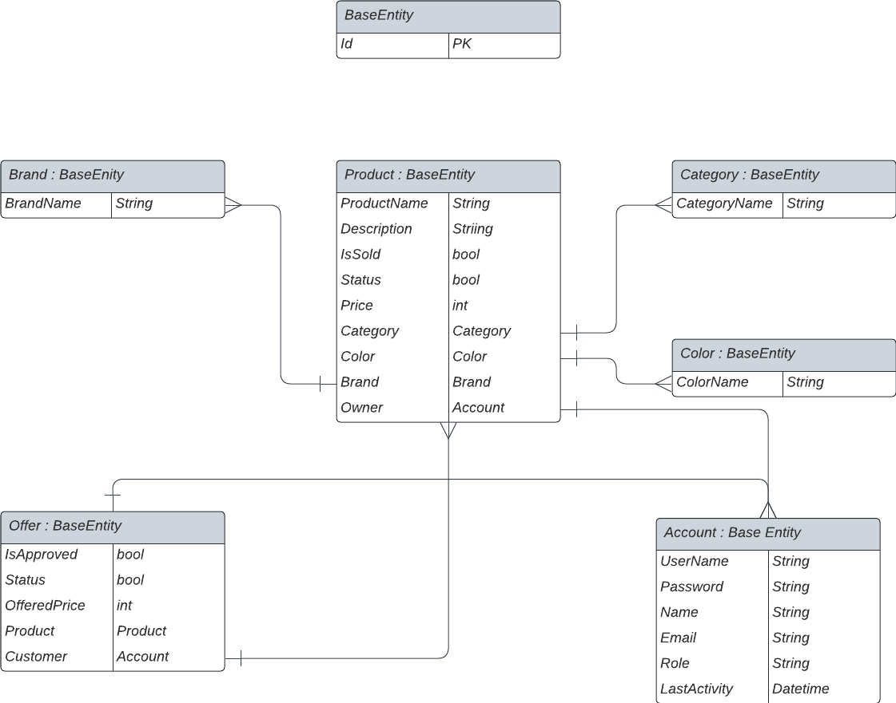

<h1>PayCore Product Catalogue</h1>


The project has been created as a Final Project of  **Patika-PayCore .Net Bootcamp**.  Project aims to provide a decent web application where user can publish products as well as make offer on existing products. 

:arrow_right: User is allowed to insert products and make offers

:arrow_right: User is allowed to create new category, color, brand for products to be inserted.

:arrow_right: User is allowed to make his/her product to be not offerable and buyable only.

:arrow_right: User is allowed to buy a product without make an offer on it.

:arrow_right: Users need to be registered to use web application.


<h2>Technologies</h2>

Technology    | Version
------------- | -------------
Visual Studio |  2019
.Net          |  5.0
PostgreSql    |  14.5 

Libraries     | 
------------- | 
FluentValidation |
AutoMapper          | 
NHibernate    |
Hangfire    |
SeriLog    | 
Nunit    |
Moq    |
Mailkit    | 


<h2>Getting Started</h2>

:one: Arrange NHibernate Configuration

Change password and database name in configuration with your own settings

 ```"ConnectionStrings": {
    "PostgreSqlConnection": "User ID=postgres;Password=YourMasterPasswordForPostgre;Server=localhost;Port=5432;Database=YourDatabaseName;Integrated Security=true;Pooling=true;"
  },
  ```

:two: Adding Admin to database

Insert admin to database using sql query below. As it can be seen password is hashed.

This is the information needed to log in as admin -> ``` UserName = Admin , Password = Admin123 ```

```mysql
INSERT INTO account (id , name, username,email,password,role,lastactivity) 
VALUES ( 1, 'Admin', 'Admin','Admin@gmail.com','e64b78fc3bc91bcbc7dc232ba8ec59e0','Admin','2022-09-17 21:53:16.2522')
```

<h2>Structure of Project</h2>

In this project, Onion Architecture has been applied as an example of Clean Archtitecture . Firstly, I should have to give credit [Güven Barış Çakan](https://github.com/guvenbaris) and his fellows [Kader Uzuner](https://github.com/KaderUzuner) and [Osman Mahmut Cepoğlu](https://github.com/osmanmahmutcepoglu) since they were an inspiration for
me to prefer using Onion Architecture.

In Onion Architecture, deeper the layer the fewer dependency it has. Deepest layer which is Domain has no dependency. The layer on Domain which is Application layer has dependency to damain. So outer layer are allowed to reference the layers that are directly below them.   

[](http://google.com.au/)


**Domain layer**

:arrow_right:Domain has no dependency. It holds application domain objects. Entities are placed here.


**Application layer**

:arrow_right:Application layer holds interfaces and services. Bussiness logic is implemented in this layer. Service interface are kept seperate to ensure loose coupling.

**Persistence Layer**

:arrow_right:Migrations and database configuration is implemented in this layer. No bussiness logic ismplemented. Only this layer knows database.

**Infrastructure Layer**

:arrow_right:Log and email service is configured here. No bussiness logic is implemented.


<h2>ER Diagram</h2>


